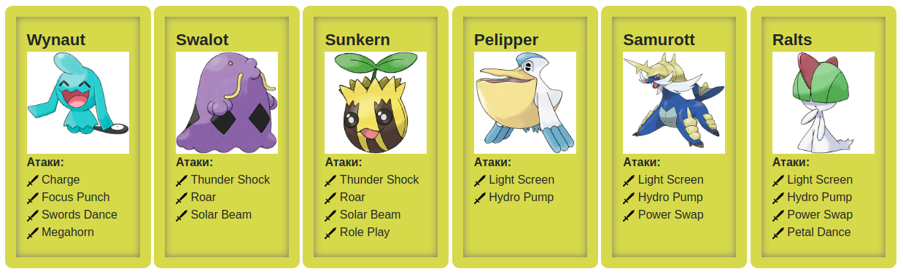

# Laboratory #2

**Variant:** 27015  
[Pokemon Library Documentation](https://se.ifmo.ru/~tony/doc/)

## Prerequisites

### Downloading the Pokemon Library

```bash
wget https://se.ifmo.ru/documents/10180/660917/Pokemon.jar/a7ce60af-6ee6-47d0-a95e-e5ed9a697bd2
```

## Задание

На основе базового класса `Pokemon` написать свои классы для заданных видов покемонов. Каждый вид покемона должен иметь один или два типа и стандартные базовые характеристики:

- очки здоровья (HP)
- атака (attack)
- защита (defense)
- специальная атака (special attack)
- специальная защита (special defense)
- скорость (speed)

Классы покемонов должны наследоваться в соответствии с цепочкой эволюции покемонов. На основе базовых классов `PhysicalMove`, `SpecialMove` и `StatusMove` реализовать свои классы для заданных видов атак.

Атака должна иметь стандартные тип, силу (power) и точность (accuracy). Должны быть реализованы стандартные эффекты атаки. Назначить каждому виду покемонов атаки в соответствии с вариантом. Уровень покемона выбирается минимально необходимым для всех реализованных атак.

Используя класс симуляции боя `Battle`, создать 2 команды покемонов (каждый покемон должен иметь имя) и запустить бой.

Базовые классы и симулятор сражения находятся в jar-архиве (обновлен 9.10.2018, исправлен баг с добавлением атак и кодировкой).

Информацию о покемонах, цепочках эволюции и атаках можно найти на сайтах:

- [Poke-Universe](http://poke-universe.ru)
- [PokemonDB](http://pokemondb.net)
- [Veekun](http://veekun.com/dex/pokemon)

Цель работы: на простом примере разобраться с основными концепциями ООП и научиться использовать их в программах.

- Ознакомиться с документацией, обращая особое внимание на классы Pokemon и Move. При дальнейшем выполнении лабораторной работы читать документацию еще несколько раз
- Скачать файл Pokemon.jar. Его необходимо будет использовать как для компиляции, так и для запуска программы. Распаковывать его не надо! Нужно научиться подключать внешние jar-файлы к своей программе
- Написать минимально работающую программу и посмотреть как она работает

    ```java
    Battle b = new Battle();
    Pokemon p1 = new Pokemon("Чужой", 1);
    Pokemon p2 = new Pokemon("Хищник", 1);
    b.addAlly(p1);
    b.addFoe(p2);
    b.go();
    ```

- Создать один из классов покемонов для своего варианта. Класс должен наследоваться от базового класса `Pokemon`. В конструкторе нужно будет задать типы покемона и его базовые характеристики. После этого попробуйте добавить покемона в сражение
- Создать один из классов атак для своего варианта (лучше всего начать с физической или специальной атаки). Класс должен наследоваться от класса PhysicalMove или SpecialMove. В конструкторе нужно будет задать тип атаки, ее силу и точность. После этого добавить атаку покемону и проверить ее действие в сражении. Не забудьте переопределить метод describe, чтобы выводилось нужное сообщение
- Если действие атаки отличается от стандартного, например, покемон не промахивается, либо атакующий покемон также получает повреждение, то в классе атаки нужно дополнительно переопределить соответствующие методы (см. документацию). При реализации атак, которые меняют статус покемона (наследники StatusMove), скорее всего придется разобраться с классом Effect. Он позволяет на один или несколько ходов изменить состояние покемона или модификатор его базовых характеристик
- Доделать все необходимые атаки и всех покемонов, распределить покемонов по командам, запустить сражение

## Покемоны данного варианта



## Отчёт по работе

- Текст задания.
- Диаграмма классов реализованной объектной модели.
- Исходный код программы.
- Результат работы программы.
- Выводы по работе

## Вопросы к защите лабораторной работы

- Объектно-ориентированное программирование. Основные понятия: объекты, наследование, полиморфизм, инкапсуляция.
- Понятие класса. Классы и объекты в Java.
- Члены класса. Модификаторы доступа.
- Создание и инициализация объектов. Вызов методов.
- Области видимости переменных.
- Модификаторы final и static.
- Пакеты, инструкция import.

## Сборка лабораторной

```bash
javac *.java moves/**/*.java pokemons/**/*.java -classpath Pokemon.jar
jar cfm Lab2.jar MANIFEST.MF *.class moves/ pokemons/ Pokemon.jar
java -jar Lab2.jar
```
