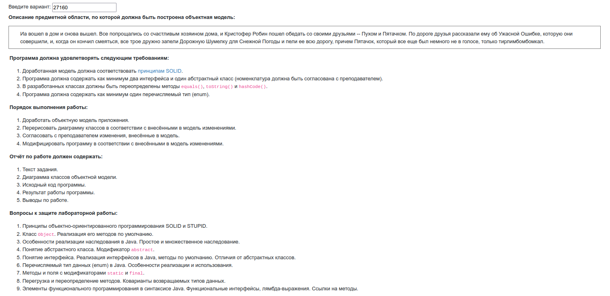
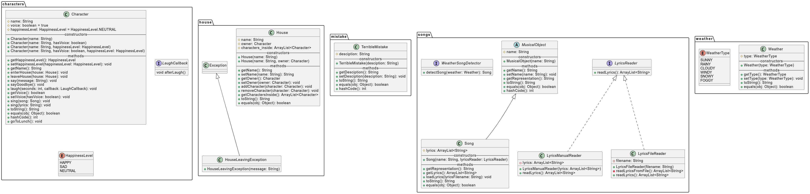

# Лабораторная работа #3



```text
Иа вошел в дом и снова вышел. Все попрощались со счастливым хозяином дома, и Кристофер Робин пошел обедать со своими друзьями -- Пухом и Пятачком. По дороге друзья рассказали ему об Ужасной Ошибке, которую они совершили, и, когда он кончил смеяться, все трое дружно запели Дорожную Шумелку для Снежной Погоды и пели ее всю дорогу, причем Пятачок, который все еще был немного не в голосе, только тирлимбомбомкал. 
```

