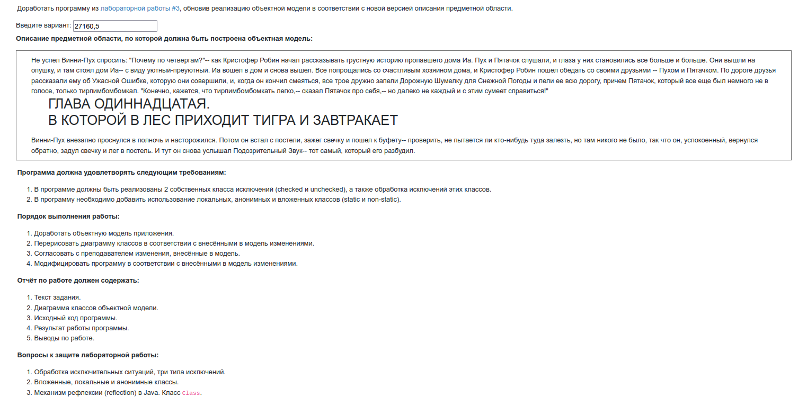
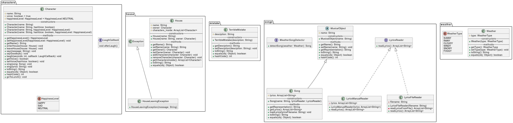

# Лабораторная работа #4



```text
Не успел Винни-Пух спросить: "Почему по четвергам?"-- как Кристофер Робин начал рассказывать грустную историю пропавшего дома Иа. Пух и Пятачок слушали, и глаза у них становились все больше и больше. Они вышли на опушку, и там стоял дом Иа-- с виду уютный-преуютный. Иа вошел в дом и снова вышел. Все попрощались со счастливым хозяином дома, и Кристофер Робин пошел обедать со своими друзьями -- Пухом и Пятачком. По дороге друзья рассказали ему об Ужасной Ошибке, которую они совершили, и, когда он кончил смеяться, все трое дружно запели Дорожную Шумелку для Снежной Погоды и пели ее всю дорогу, причем Пятачок, который все еще был немного не в голосе, только тирлимбомбомкал. "Конечно, кажется, что тирлимбомбомкать легко,-- сказал Пятачок про себя,-- но далеко не каждый и с этим сумеет справиться!"

    ГЛАВА ОДИННАДЦАТАЯ.
    В КОТОРОЙ В ЛЕС ПРИХОДИТ ТИГРА И ЗАВТРАКАЕТ

Винни-Пух внезапно проснулся в полночь и насторожился. Потом он встал с постели, зажег свечку и пошел к буфету-- проверить, не пытается ли кто-нибудь туда залезть, но там никого не было, так что он, успокоенный, вернулся обратно, задул свечку и лег в постель. И тут он снова услышал Подозрительный Звук-- тот самый, который его разбудил. 
```


